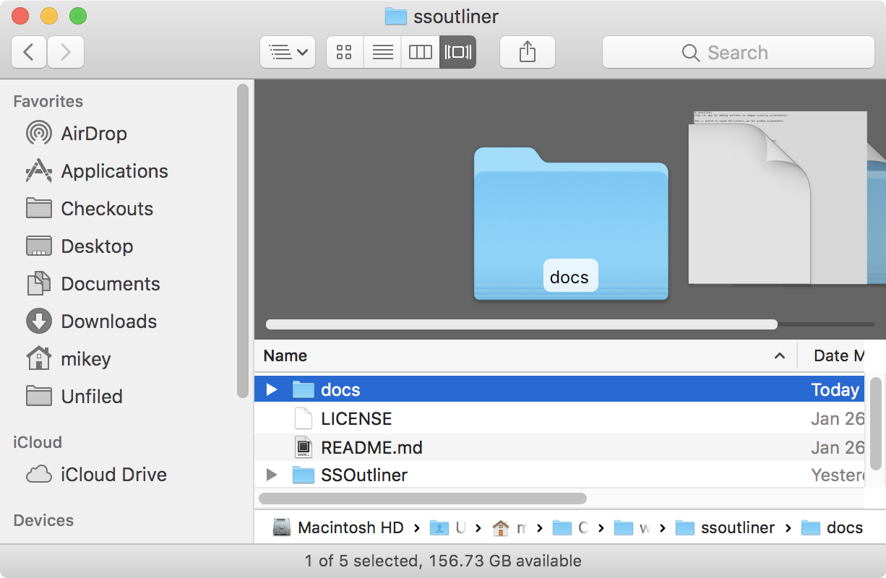
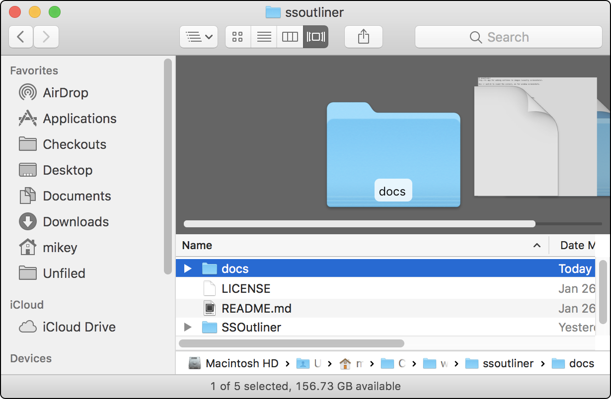

# ssoutliner
Tiny CLI macOS app for adding outlines to images (usually screenshots). Outlines can have hard or rounded corners. By default, it will output the outlined image to a separate file, but can optionally overwrite the original instead.

# installation

Copy `ssoutliner` into a folder in your `$PATH`. I put mine in `/usr/local/bin/`.

Eventually, I'll get around to adding a [Homebrew](https://brew.sh) recipe.

# usage
```
usage: ssoutliner [-r] [-o] files...
flags:
  -r, --rounded
      Round the corners. Suitable for window screenshots.
  -o, --overwrite
      Overwrite input file. Otherwise, new file is saved as filename_ssoutlined.png.

Output overwrites input file.
```

# finder service workflows

There is a bundled pair of Automator-based Finder Services.

To install, drag `Outline (cornered).workflow` and/or `Outline (cornered).workflow` into your `~/Library/Services/` folder.

To use, select one or more image files in Finder, right click, and select one of the above services from the Services submenu.

Note that these workflows output to a separate file, and do not use the `-o` option. Of course, you can edit them to suit your taste.

# samples



