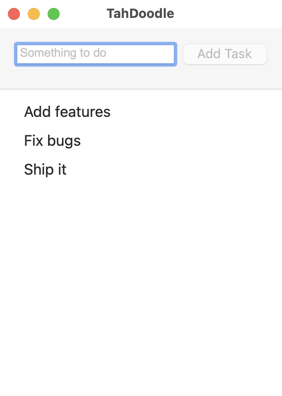

# ssoutliner
Tiny CLI macOS app for adding outlines to images (usually screenshots). Outlines can have hard or rounded corners. By default, it will output the outlined image to a separate file, but can optionally overwrite the original instead.

# installation

Copy `ssoutliner` into a folder in your `$PATH`. I put mine in `/usr/local/bin/`.

Eventually, I'll get around to adding a [Homebrew](https://brew.sh) recipe.

# usage
```
    usage:
      ssoutliner [-r] [-o] [-c XXXX]  files...
    flags:
      -o, --overwrite
          Overwrite the input file.
          Otherwise, output is written to originalfilename_outlined.png.
      -c XXXX, --corner-mask XXXX
          Round the specified corners, where XXXX is a 4-bit binary mask indicating the corners to round.
          The digits represent the corners: Top Left, Top Right, Bottom Right, Bottom Left.
          A 1 means to round the potsitional corner, 0 means to leave it alone.
          The unquoted strings "top" and "all" are acceptable substitutes for 1100 and 1111 respectively.
          This option is designed for window screenshots.
          Without this option, all four corners will be un-rounded.
      -r, --retina
          Adjust line thickness and rounded corner radius for
      -h, --help
          Display this help information and exit.
    example:
      ssoutliner -r -c 0010 screenshot1.png screenshot2.png
          screen.png and screen2.png will both be outlined,
          rounding only the bottom-right corner,
          with retina-screenshot-optimized lines,
          and the output will be written to screen_outlined.png and screen2_outlined.png.
```

# finder service workflows

There is a bundled pair of Automator-based Finder Services.

To install, drag `Outline (retina,cornered).workflow` and/or `Outline (retina,rounded).workflow` into your `~/Library/Services/` folder.

These are Automator workflows, so you can duplicate and edit as desired for your common needs.

To use, select one or more image files in Finder, right click, and select one of the above services from the Services submenu.

Note that these workflows output to a separate file, and do not use the `-o` option. Of course, you can edit them to suit your taste.

# samples



